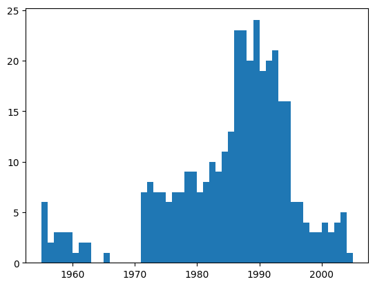
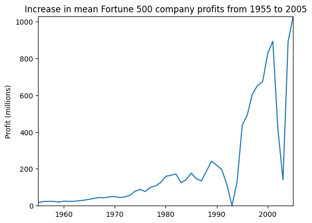

## 实验三
####  实验内容
安装Jupyter Notebook和相关的Python环境，建议采用Anaconda的安装方式。

按照教程完成实验过程，主要包括几个方面：
掌握Notebook工具的基本原理
学习Python基本语法，完成选择排序程序
完成Python数据分析的例子
将上述完成的Jupyter Notebook在Github上进行共享。


观察页面，可以看到浏览器中显示类似https://localhost:8888/tree.的网址，代表本地运行着Notebook的服务器


```python
print('Hello World!')
```

## 创建一个新的Notebook
#### 这里有两个关键元素cell和kernal

cell: 文本或者代码执行单元，由kernel执行。
kernel: 计算引擎，执行cell的文本或者代码，本文基于Python 3 ipykernel引擎。

代码执行之后，cell左侧的标签从In [ ] 变成了 In [1]。In代表输入，[]中的数字代表kernel执行的顺序，而In [*]则表示代码cell正在执行代码。以下例子显示了短暂的In [*]过程。


```python
import time
time.sleep(3)

```

## 快捷键
使用Ctrl + Shift + P命令可以查看所有Notebook支持的命令。

在命名模式下，一些快捷键将十分有帮助

上下键头可以上下cell移动
A 或者 B在上方或者下方插入一个cell
M 将转换活动cell为Markdown cell
Y 将设置活动cell为代码 cell
D+D（两次）删除cell
Z 撤销删除
H 打开所有快捷键的说明
在编辑模式，Ctrl + Shift + -将以光标处作为分割点，将cell一分为二。

## Kernel
每个notebook都基于一个内核运行，当执行cell代码时，代码将在内核当中运行，运行的结果会显示在页面上。Kernel中运行的状态在整个文档中是延续的，可以跨越所有的cell。这意思着在一个Notebook某个cell定义的函数或者变量等，在其他cell也可以使用。例如：


# cell模式
有两种模式，编辑模式（edit mode）和命名模式（command mode）

编辑模式：enter健切换，绿色轮廓
命令模式：esc健切换，蓝色轮廓


```python
import numpy as np
def square(x):
    return x * x
x = np.random.randint(1, 10)
y = square(x)
print('%d squared is %d' % (x, y))

```


## 数据分析的例子


```python
%matplotlib inline
import pandas as pd
import matplotlib.pyplot as plt
import seaborn as sns
df = pd.read_csv('D:\\acoroda\\fortune500.csv')

df.head()


```


<div>
<style scoped>
    .dataframe tbody tr th:only-of-type {
        vertical-align: middle;
    }

    .dataframe tbody tr th {
        vertical-align: top;
    }

    .dataframe thead th {
        text-align: right;
    }
</style>
<table border="1" class="dataframe">
  <thead>
    <tr style="text-align: right;">
      <th></th>
      <th>Year</th>
      <th>Rank</th>
      <th>Company</th>
      <th>Revenue (in millions)</th>
      <th>Profit (in millions)</th>
    </tr>
  </thead>
  <tbody>
    <tr>
      <th>0</th>
      <td>1955</td>
      <td>1</td>
      <td>General Motors</td>
      <td>9823.5</td>
      <td>806</td>
    </tr>
    <tr>
      <th>1</th>
      <td>1955</td>
      <td>2</td>
      <td>Exxon Mobil</td>
      <td>5661.4</td>
      <td>584.8</td>
    </tr>
    <tr>
      <th>2</th>
      <td>1955</td>
      <td>3</td>
      <td>U.S. Steel</td>
      <td>3250.4</td>
      <td>195.4</td>
    </tr>
    <tr>
      <th>3</th>
      <td>1955</td>
      <td>4</td>
      <td>General Electric</td>
      <td>2959.1</td>
      <td>212.6</td>
    </tr>
    <tr>
      <th>4</th>
      <td>1955</td>
      <td>5</td>
      <td>Esmark</td>
      <td>2510.8</td>
      <td>19.1</td>
    </tr>
  </tbody>
</table>
</div>


```python


df.tail()
```


<div>
<style scoped>
    .dataframe tbody tr th:only-of-type {
        vertical-align: middle;
    }

    .dataframe tbody tr th {
        vertical-align: top;
    }

    .dataframe thead th {
        text-align: right;
    }
</style>
<table border="1" class="dataframe">
  <thead>
    <tr style="text-align: right;">
      <th></th>
      <th>Year</th>
      <th>Rank</th>
      <th>Company</th>
      <th>Revenue (in millions)</th>
      <th>Profit (in millions)</th>
    </tr>
  </thead>
  <tbody>
    <tr>
      <th>25495</th>
      <td>2005</td>
      <td>496</td>
      <td>Wm. Wrigley Jr.</td>
      <td>3648.6</td>
      <td>493</td>
    </tr>
    <tr>
      <th>25496</th>
      <td>2005</td>
      <td>497</td>
      <td>Peabody Energy</td>
      <td>3631.6</td>
      <td>175.4</td>
    </tr>
    <tr>
      <th>25497</th>
      <td>2005</td>
      <td>498</td>
      <td>Wendy's International</td>
      <td>3630.4</td>
      <td>57.8</td>
    </tr>
    <tr>
      <th>25498</th>
      <td>2005</td>
      <td>499</td>
      <td>Kindred Healthcare</td>
      <td>3616.6</td>
      <td>70.6</td>
    </tr>
    <tr>
      <th>25499</th>
      <td>2005</td>
      <td>500</td>
      <td>Cincinnati Financial</td>
      <td>3614.0</td>
      <td>584</td>
    </tr>
  </tbody>
</table>
</div>


```python
%matplotlib inline
import pandas as pd
import matplotlib.pyplot as plt
import seaborn as sns
df = pd.read_csv('D:\\acoroda\\fortune500.csv')

df.head()
df.tail()
df.columns = ['year', 'rank', 'company', 'revenue', 'profit']
len(df)
```


    25500


```python
df.columns = ['year', 'rank', 'company', 'revenue', 'profit']

```


```python
df.dtypes


```


    Year                       int64
    Rank                       int64
    Company                   object
    Revenue (in millions)    float64
    Profit (in millions)      object
    dtype: object


```python
non_numberic_profits = df.profit.str.contains('[^0-9.-]')
df.loc[non_numberic_profits].head()


```


<div>
<style scoped>
    .dataframe tbody tr th:only-of-type {
        vertical-align: middle;
    }

    .dataframe tbody tr th {
        vertical-align: top;
    }

    .dataframe thead th {
        text-align: right;
    }
</style>
<table border="1" class="dataframe">
  <thead>
    <tr style="text-align: right;">
      <th></th>
      <th>year</th>
      <th>rank</th>
      <th>company</th>
      <th>revenue</th>
      <th>profit</th>
    </tr>
  </thead>
  <tbody>
    <tr>
      <th>228</th>
      <td>1955</td>
      <td>229</td>
      <td>Norton</td>
      <td>135.0</td>
      <td>N.A.</td>
    </tr>
    <tr>
      <th>290</th>
      <td>1955</td>
      <td>291</td>
      <td>Schlitz Brewing</td>
      <td>100.0</td>
      <td>N.A.</td>
    </tr>
    <tr>
      <th>294</th>
      <td>1955</td>
      <td>295</td>
      <td>Pacific Vegetable Oil</td>
      <td>97.9</td>
      <td>N.A.</td>
    </tr>
    <tr>
      <th>296</th>
      <td>1955</td>
      <td>297</td>
      <td>Liebmann Breweries</td>
      <td>96.0</td>
      <td>N.A.</td>
    </tr>
    <tr>
      <th>352</th>
      <td>1955</td>
      <td>353</td>
      <td>Minneapolis-Moline</td>
      <td>77.4</td>
      <td>N.A.</td>
    </tr>
  </tbody>
</table>
</div>


确实存在这样的记录，profit这一列为字符串，统计一下到底存在多少条这样的记录。


```python
len(df.profit[non_numberic_profits])

```


    369


```python
bin_sizes, _, _ = plt.hist(df.year[non_numberic_profits], bins=range(1955, 2006))

```


    

    


可见，单独年份这样的记录数都少于25条，即少于4%的比例。这在可以接受的范围内，因此删除这些记录。


```python
df = df.loc[~non_numberic_profits]
df.profit = df.profit.apply(pd.to_numeric)

```

    C:\Users\DSHH\AppData\Local\Temp\ipykernel_10972\234130552.py:2: SettingWithCopyWarning: 
    A value is trying to be set on a copy of a slice from a DataFrame.
    Try using .loc[row_indexer,col_indexer] = value instead
    
    See the caveats in the documentation: https://pandas.pydata.org/pandas-docs/stable/user_guide/indexing.html#returning-a-view-versus-a-copy
      df.profit = df.profit.apply(pd.to_numeric)
    


```python
len(df)

```


    25131


df.dtypes


### 可见，上述操作已经达到清洗无效数据记录的效果

# 使用matplotlib进行绘图
## 接下来，以年分组绘制平均利润和收入。首先定义变量和方法。


```python
group_by_year = df.loc[:, ['year', 'revenue', 'profit']].groupby('year')
avgs = group_by_year.mean()
x = avgs.index
y1 = avgs.profit
def plot(x, y, ax, title, y_label):
    ax.set_title(title)
    ax.set_ylabel(y_label)
    ax.plot(x, y)
    ax.margins(x=0, y=0)

```


```python
fig, ax = plt.subplots()
plot(x, y1, ax, 'Increase in mean Fortune 500 company profits from 1955 to 2005', 'Profit (millions)')

```


    

    


```python

y2 = avgs.revenue
fig, ax = plt.subplots()
plot(x, y2, ax, 'Increase in mean Fortune 500 company revenues from 1955 to 2005', 'Revenue (millions)')


```


    

    


### 看起来像指数增长，但是1990年代初期出现急剧的下滑，对应当时经济衰退和网络泡沫。再来看看收入曲线。


```python
def plot_with_std(x, y, stds, ax, title, y_label):
    ax.fill_between(x, y - stds, y + stds, alpha=0.2)
    plot(x, y, ax, title, y_label)
fig, (ax1, ax2) = plt.subplots(ncols=2)
title = 'Increase in mean and std Fortune 500 company %s from 1955 to 2005'
stds1 = group_by_year.std().profit.values
stds2 = group_by_year.std().revenue.values
plot_with_std(x, y1.values, stds1, ax1, title % 'profits', 'Profit (millions)')
plot_with_std(x, y2.values, stds2, ax2, title % 'revenues', 'Revenue (millions)')
fig.set_size_inches(14, 4)
fig.tight_layout()

```


    

    


## 公司收入曲线并没有出现急剧下降，可能是由于财务会计的处理。对数据结果进行标准差处理。

# 导出Notebooks

使用"File > Download as"可以以多种格式导出Notebooks，例如：html, pdf, markdown文档等。如果希望以协同方式共享.ipynb，则可以借助相关的在线平台，如Github或者Google Colab。

# upyter Notebook扩展工具
Jupter Notebook的扩展工具(extensions)可以提供丰富的附加功能，例如代码补全、内容目录、变量检查等。本节演示如何安装扩展工具和启用代码补全功能。
首先Anaconda Navigator中启动命令行终端，

## 在弹出的终端中依次输入下面4条命令，注意要耐心等待命令执行完成。

pip install jupyter_contrib_nbextensions

jupyter contrib nbextension install --user

pip install jupyter_nbextensions_configurator

jupyter nbextensions_configurator enable --user


### 等待最后结果（运行成功的结果）
####  完成勾选（按照教程勾选即可）


